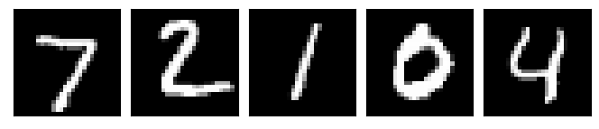

# Recurrent Attention Model

This repository is a PyTorch implementation of the Recurrent Attention Model (RAM) from the [Recurrent Models of Visual Attention (2014)](https://arxiv.org/abs/1406.6247) paper by Mnih et al.

<p align="center">
 
</p>

### Glimpse Sensor

The glimpse sensor (A) is used to extract a *glimpse* (a partial view) from an image. A glimpse can be made of multiple *patches*, where each patch is twice as big as the previous but all are scaled down to a designated *patch size*.

The first row shows the original image. The second row shows the 8x8 unscaled glimpse. The next row shows a 16x16 glimpse scaled down to 8x8 resolution. The final row shows a 32x32 glimpse, again scaled down to 8x8 resolution. All of the 3 glimpses are centered on the centre of the 28x28 MNIST digit image.

<p align="center">
 
 
 
 
</p>

### Glimpse Network

The glimpse network (B) takes in an image and a location, (x,y) co-ordinates of where to center the glimpse. It then extracts a glimpse using the glimpse sensor and maps both the glimpse and location to a hidden dimension, and then combines the two hidden dimensions.

### Core Network

The core network (C) uses the output of the glimpse network and the RAM's hidden state from the previous time-step to produce: an action, a prediction of the image's class, and the next location to be used by the glimpse network and glimpse sensor in the next time-step.

## Experiments

The following shows how to replicate the 4 experiments in the paper, from Tables 1 and 2. Hyperparameters not given in the paper were taken from other implementations of the RAM paper.

This implementation also allows us to experiment on the KMNIST and the FashionMNIST datasets by simply using `--data KMNIST` or `--data FashionMNIST`. Other command line arguments can be seen in `train.py`. 

### Experiment 1

```
python train.py --data MNIST --n_glimpses 6 --patch_size 8 --n_patches 1 --scale 2 --std 0.15 --seed 1
```

This experiment sees how well the RAM can combine multiple glimpses to give accuracy predictions. It uses 6 glimpses, each a single 8x8 patch.

<p align="center">
 
</p>

### Experiment 2

```
python train.py --data MNIST --translated_size 60 --n_glimpses 8 --patch_size 12 --n_patches 3 --scale 2 --std 0.25 --seed 1
```

This experiment is to test the RAM's ability to search for an object which is not centered in an image. The 28x28 MNIST digits are randomly located within the 60x60 image. It uses 8 glimpses, each with 3 scaled 12x12 patches.

<p align="center">
 
</p>

### Experiment 3

```
python train.py --data MNIST --translated_size 60 --n_clutter 4 --clutter_size 8 --n_glimpses 8 --patch_size 12 --n_patches 3 --scale 2 --std 0.25 --seed 1
```

This experiment checks if the RAM can locate the relevant object in a cluttered image. The clutter is made by a random 8x8 patch of an MNIST digit. There are 4 pieces of clutter per image, each placed randomly within the image before the target digit is placed, also randomly. It uses 8 glimpses, each with 3 scaled 12x12 patches.

<p align="center">
 
</p>

### Experiment 4 

```
python train.py --data MNIST --translated_size 100 --n_clutter 4 --clutter_size 8 --n_glimpses 8 --patch_size 12 --n_patches 4 --scale 2 --std 0.25 --seed 1
```

This is the same as the last experiment, but with a large image size. It uses 8 glimpses, each with 4 scaled 12x12 patches.

<p align="center">
 
</p>

## Results

Results in the table below are test error rates, i.e. lower is better. 

The models have not been subject to an extensive hyperparameter search so, in theory, could be improved upon.

<p align="center">

| Experiment | Paper | This Repo. |
|------------|-------|------------|
| 28x28 MNIST w/ 6 Glimpses, 8x8, 1 scale | 1.29% | 1.08% w/ std = 0.15 |
| 60x60 Translated MNIST w/ 8 Glimpses, 12x12, 3 scales | 1.84% | 1.87% w/ std = 0.25|
| 60x60 Translated Cluttered MNIST w/ 8 Glimpses, 12x12, 3 scales | 5.23% | 2.13% w/ std = 0.25 |
| 100x100 Translated Cluttered MNIST w/ 8 Glimpses, 12x12, 4 scales | 10.83% | 6.74% |

<p>

## Requirements 

- Python 3.6+
- PyTorch 1.4

## References

- https://github.com/kevinzakka/recurrent-visual-attention
- https://github.com/ipod825/recurrent-visual-attention/
- http://torch.ch/blog/2015/09/21/rmva.html
- https://robromijnders.github.io/RAM/
- https://github.com/hehefan/Recurrent-Attention-Model
- https://github.com/amasky/ram