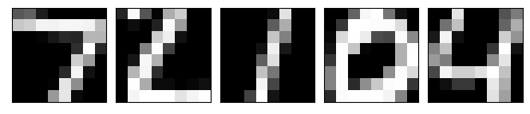

# Recurrent Attention Model

 
 
 
 

 

 

 

## Results

| Experiment | Paper | This Repo. |
|------------|-------|------------|
| 28x28 MNIST w/ 6 Glimpses, 8x8, 1 scale | 1.29% | 1.08% w/ std = 0.15 |
| 60x60 Translated MNIST w/ 8 Glimpses, 12x12, 3 scales | 1.84% | 1.87% w/ std = 0.25|
| 60x60 Translated MNIST w/ 8 Glimpses, 12x12, 3 scales | 5.23% | 2.13% w/ std = 0.25 |

## References

- https://github.com/kevinzakka/recurrent-visual-attention
- https://github.com/ipod825/recurrent-visual-attention/
- http://torch.ch/blog/2015/09/21/rmva.html
- https://robromijnders.github.io/RAM/
- https://github.com/hehefan/Recurrent-Attention-Model
- https://github.com/amasky/ram